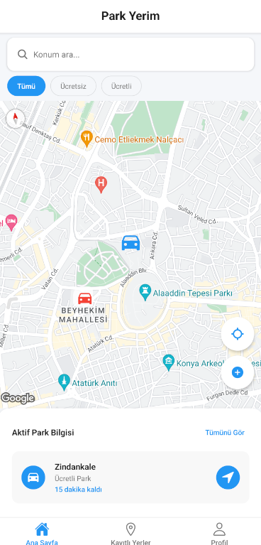
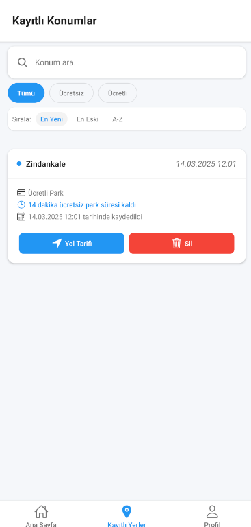
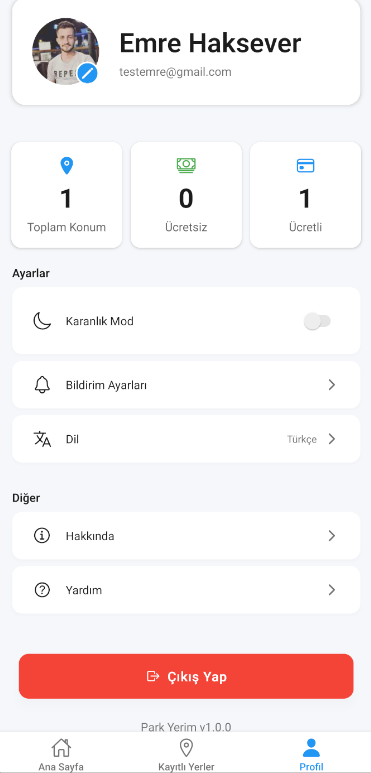

# MyParking

MyParking, araç sahiplerinin park yerlerini kolayca bulmasını, kaydetmesini ve yönetmesini sağlayan bir mobil uygulamadır. Kullanıcılar, park ettikleri yerleri harita üzerinde işaretleyebilir, favori park alanlarını kaydedebilir ve park süresi dolmadan önce bildirim alabilirler.

## Özellikler

- **Kullanıcı Kimlik Doğrulama**: Güvenli giriş ve kayıt sistemi
- **Harita Entegrasyonu**: Gerçek zamanlı konum takibi ve park yeri işaretleme
- **Park Yeri Kaydetme**: Sık kullanılan park yerlerini kaydetme ve yönetme
- **Bildirimler**: Park süresi dolmadan önce hatırlatma bildirimleri
- **Koyu/Açık Tema**: Kullanıcı tercihine göre tema değiştirme özelliği
- **Profil Yönetimi**: Kullanıcı bilgilerini düzenleme ve görüntüleme

## Ekran Görüntüleri

<div style="display: flex; flex-direction: row; flex-wrap: wrap; gap: 10px; justify-content: center;">
  
  
  
  
</div>

## Teknolojiler

- **React Native**: Mobil uygulama geliştirme çerçevesi
- **Expo**: Geliştirme ve dağıtım araçları
- **Firebase**: Kimlik doğrulama, veritabanı ve bildirim hizmetleri
- **React Navigation**: Ekranlar arası gezinme
- **React Native Maps**: Harita entegrasyonu
- **Expo Location**: Konum hizmetleri
- **Expo Notifications**: Bildirim yönetimi

## Kurulum

### Gereksinimler

- Node.js (v14 veya üzeri)
- npm veya yarn
- Expo CLI
- Android Studio veya Xcode (fiziksel cihazda test etmek için)

### Adımlar

1. Projeyi klonlayın:
   ```bash
   git clone https://github.com/kullaniciadi/MyParking.git
   cd MyParking
   ```

2. Bağımlılıkları yükleyin:
   ```bash
   npm install
   # veya
   yarn install
   ```

3. Firebase yapılandırması:
   - Firebase konsolunda yeni bir proje oluşturun
   - Authentication ve Firestore hizmetlerini etkinleştirin
   - google-services.json dosyasını projenin kök dizinine yerleştirin
   - **Önemli Güvenlik Notu:** `google-services.json` ve diğer yapılandırma dosyalarını GitHub'a yüklemeden önce `.gitignore` dosyasına eklediğinizden emin olun. Bu dosyalar API anahtarları gibi hassas bilgiler içerir.

4. Uygulamayı başlatın:
   ```bash
   npm start
   # veya
   yarn start
   ```

5. Expo Go uygulamasını kullanarak QR kodu tarayın veya bir emülatör başlatın.

## Kullanım

1. **Giriş Yapma**: E-posta ve şifrenizle giriş yapın veya yeni bir hesap oluşturun
2. **Park Yeri İşaretleme**: Ana ekrandaki haritada aracınızı park ettiğiniz yeri işaretleyin
3. **Park Süresi Ayarlama**: Park sürenizi ayarlayın ve bildirim almak için zamanlayıcı kurun
4. **Kayıtlı Yerler**: Sık kullandığınız park yerlerini kaydedin ve yönetin
5. **Profil Yönetimi**: Profil ekranından kişisel bilgilerinizi güncelleyin ve uygulama ayarlarını değiştirin

## Katkıda Bulunma

1. Bu depoyu forklayın
2. Yeni bir özellik dalı oluşturun (`git checkout -b feature/amazing-feature`)
3. Değişikliklerinizi commit edin (`git commit -m 'Add some amazing feature'`)
4. Dalınıza push edin (`git push origin feature/amazing-feature`)
5. Bir Pull Request açın


## İletişim

E-posta: emre.haksever2@gmail.com

GitHub:https://github.com/EmreHaksever/MyParking.git

Linkedin: https://www.linkedin.com/in/emre-haksever-81382230a/